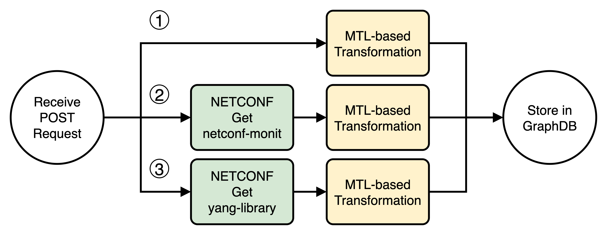

# Network Data Catalog (NDC) Knowledge Graph

This repository contains the Apache Camel data pipelines and declarative mappings to build the NDC Knowledge Graph. This knowledge graph is aligned with the [NDC Ontology](https://github.com/candil-data-fabric/network-data-catalog-ontology).

The figure below illustrates the workflow implemented with the Apache Camel application.



The workflow starts when the NetOps engineer sends a POST request to the REST API implemented with Camel to register a new network device in the NDC KG. The registration triggers the execution of multiple parallel routes in Camel, each integratimg data from a different data source into NDC KG. Notably, routes 2 and 3 leverage the NETCONF connector to ingest YANG data from the network device using the NETCONF protocol.

Before executing the Camel routes, deploy GraphDB container:

```bash
docker container run --rm -it -p 7200:7200 \
  -v ./graphdb/data:/opt/graphdb/home \
  -v ./graphdb/imports:/root/graphdb-import \
  ontotext/graphdb:10.8.9
```

Once GraphDB has started, make sure to create a repository in the database.

```bash
curl -X POST \
  http://localhost:7200/rest/repositories \
  -H "Content-Type: multipart/form-data" \
  -F "config=@graphdb/init/config.ttl"
```

## Scenario

The prototype has been tested against a containerized network scenario based on the [Containerlab tool](https://containerlab.dev) and the [Nokia SR Linux](https://containerlab.dev/manual/kinds/srl/) 24.10 router.

More details on this scenario can be found in folder [srl01](./srl01/).
